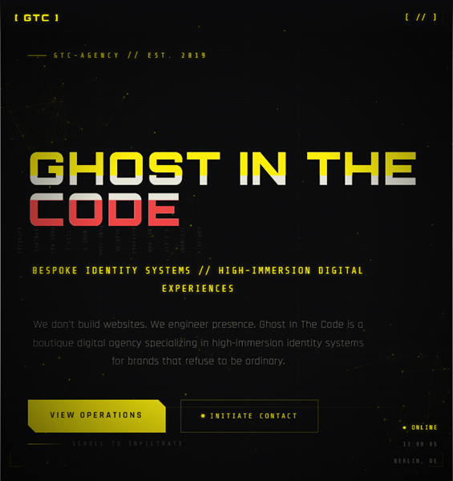

# [Ghost In The Code]

> A fast, considered web experience built with precision. 

### [Live Production Preview](https://ghost-in-the-code.madebyever.com/)

---

## Core Focus

Ghost In The Code is a digital identity system for a fictional high-immersion agency in the gaming and creative tech space.
The design brief was simple and uncompromising: the interface itself is the brand.

## The Tech Stack

* **Framework:** React 19 + Vite
* **Styling:** 	CSS Modules + Canvas API
* **Language:** JavaScript
* **Icons & Assets:** Images from open source platforms

## Key Features

* **Performance-First Architecture:** Minimal client-side JavaScript bundle sizes.
* **Intersection Observer:** A reusable useInView hook drives all scroll-triggered reveals.
* **Responsive Fluid Grid:** Designed for flawless scaling across ultra-wide displays and mobile breakpoints.
* **Micro-Interactions:** Custom spring physics animations for interactive states.